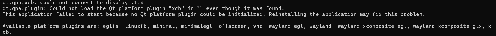
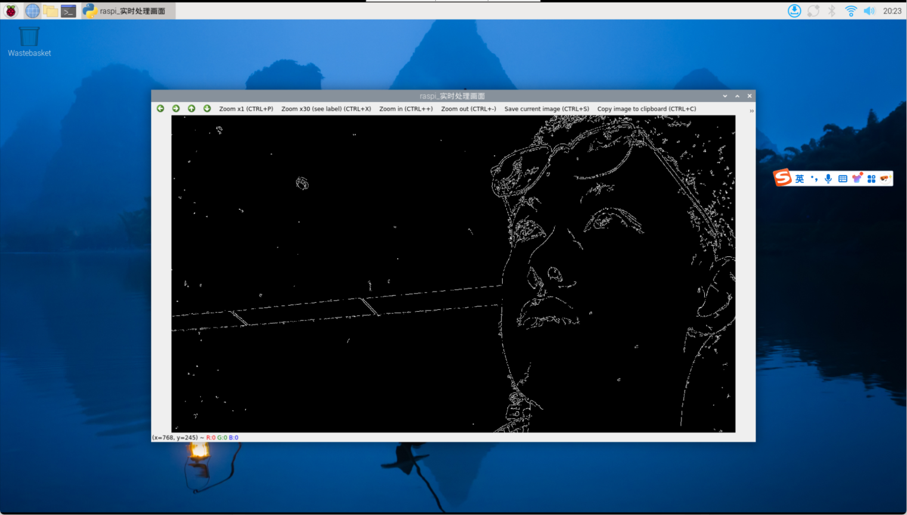

## 一、opencv挂在vnc上的一些指令和问题
1. rpicam-hello --list-cameras 列出我当前连接camera的信息
2. sudo lsof -i :5900 查看被占用的端口
3. 默认用qt的方式将图像显示在vnc上，默认用的x11，但是会报错，
 
 然后看x11的状态发现被占用了，用2就可以看到是wayland占用了，export图形显示为wayland就可以显示在vnc上了
 